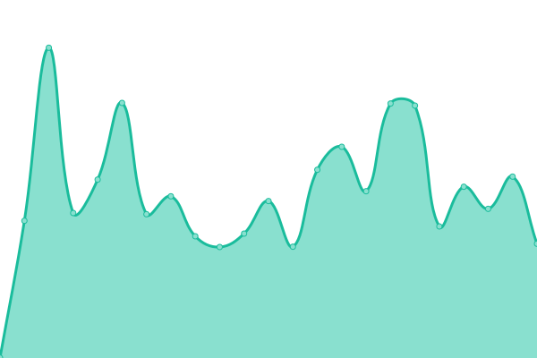
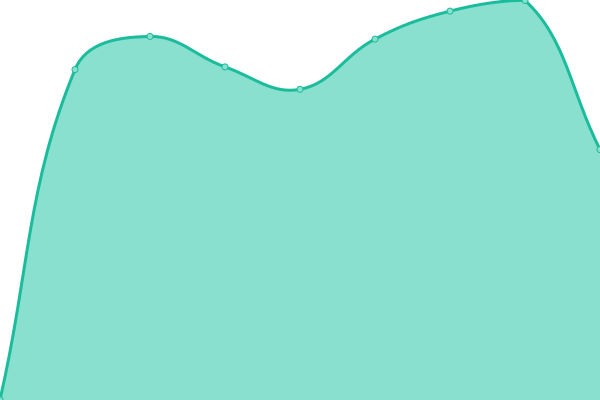
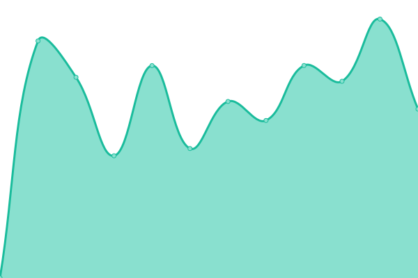

# [📈 Live Status](https://vlados.github.io/status): <!--live status--> **🟧 Partial outage**

This repository contains the open-source uptime monitor and status page for [Vladislav Stoitsov](https://www.vladko.dev/), powered by [Upptime](https://github.com/upptime/upptime).

With [Upptime](https://upptime.js.org), you can get your own unlimited and free uptime monitor and status page, powered entirely by a GitHub repository. We use [Issues](https://github.com/vlados/status/issues) as incident reports, [Actions](https://github.com/vlados/status/actions) as uptime monitors, and [Pages](https://vlados.github.io/status) for the status page.

<!--start: status pages-->
<!-- This summary is generated by Upptime (https://github.com/upptime/upptime) -->
<!-- Do not edit this manually, your changes will be overwritten -->
<!-- prettier-ignore -->
| URL | Status | History | Response Time | Uptime |
| --- | ------ | ------- | ------------- | ------ |
|  [vladko.dev](https://www.vladko.dev) | 🟩 Up | [vladko-dev.yml](https://github.com/vlados/status/commits/HEAD/history/vladko-dev.yml) | 

 353ms
     
 | 

<a href="https://status.vladko.dev/history/vladko-dev">100.00%</a>
    

|  [udoma.bg](https://www.udoma.bg) | 🟩 Up | [udoma-bg.yml](https://github.com/vlados/status/commits/HEAD/history/udoma-bg.yml) | 

 547ms
     
 | 

<a href="https://status.vladko.dev/history/udoma-bg">100.00%</a>
    

|  [ashop.bg](http://ashop.bg) | 🟩 Up | [ashop-bg.yml](https://github.com/vlados/status/commits/HEAD/history/ashop-bg.yml) | 

 1264ms
     
 | 

<a href="https://status.vladko.dev/history/ashop-bg">100.00%</a>
    

|  [puglia.bg](https://www.puglia.bg/) | 🟩 Up | [puglia-bg.yml](https://github.com/vlados/status/commits/HEAD/history/puglia-bg.yml) | 

 657ms
     
 | 

<a href="https://status.vladko.dev/history/puglia-bg">100.00%</a>
    

|  [BG Property invest](https://bgpropertyinvest.com/) | 🟩 Up | [bg-property-invest.yml](https://github.com/vlados/status/commits/HEAD/history/bg-property-invest.yml) | 

 433ms
     
 | 

<a href="https://status.vladko.dev/history/bg-property-invest">100.00%</a>
    

|  [KSP Electronics](https://ksp-electronics.com/) | 🟩 Up | [ksp-electronics.yml](https://github.com/vlados/status/commits/HEAD/history/ksp-electronics.yml) | 

 2129ms
     
 | 

<a href="https://status.vladko.dev/history/ksp-electronics">100.00%</a>
    

|  [OMS Engeneering](https://oms-engineering.net/) | 🟥 Down | [oms-engeneering.yml](https://github.com/vlados/status/commits/HEAD/history/oms-engeneering.yml) | 

 305ms
     
 | 

<a href="https://status.vladko.dev/history/oms-engeneering">100.00%</a>
    

|  [Galardo.bg](https://galardo.bg/) | 🟩 Up | [galardo-bg.yml](https://github.com/vlados/status/commits/HEAD/history/galardo-bg.yml) | 

 1671ms
     
 | 

<a href="https://status.vladko.dev/history/galardo-bg">100.00%</a>
    

<!--end: status pages-->

[**Visit our status website →**](https://vlados.github.io/status)

## 📄 License

- Powered by: [Upptime](https://github.com/upptime/upptime)
- Code: [MIT](./LICENSE) © [Vladislav Stoitsov](https://www.vladko.dev/)
- Data in the `./history` directory: [Open Database License](https://opendatacommons.org/licenses/odbl/1-0/)
